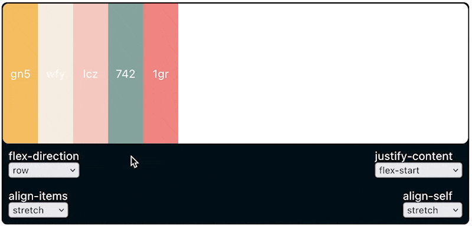

# Flex Widget

> A widget for playing around with different flex box properties



## Try it

You can try it on CodeSandbox [https://codesandbox.io/s/flex-widget-9xwrvx](https://codesandbox.io/s/flex-widget-9xwrvx)

## Usage

You can include the widget on your website like this:

```html
<!DOCTYPE html>
<html lang="en">
  <head>
    <meta charset="UTF-8" />
    <meta name="viewport" content="width=device-width, initial-scale=1.0" />
    <meta http-equiv="X-UA-Compatible" content="ie=edge" />
    <title>Static Template</title>
  </head>
  <body>
    <!-- Here's an example of how you can set your own styling -->
    <div style="margin: 100px auto; max-width: 400px;">
      <div class="flex_widget"></div>
    </div>

    <!-- Or leave the constraints completely up to the react app -->
    <div class="flex_widget"></div>

    <!-- Below are the JS and CSS files that you need to include when using the flex widget widget -->
    <link
      href="https://florian42.github.io/flex-widget/index.css"
      rel="stylesheet"
    />
    <script src="https://florian42.github.io/flex-widget/index.js"></script>
  </body>
</html>

```
